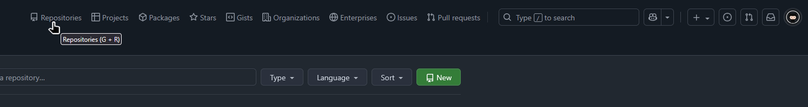

<h1 align="center">
GitHub - Enhanced Shortcuts & Header Toolbar
</h1>

Userscript for browsers that extends GitHub navigation with a customizable header toolbar and unified, layout‑independent keyboard shortcuts.

## ✨ Features

- Works on both **github.com** and **gist.github.com**
- Adds quick-access buttons (Repositories, Stars, Gists, etc.) to the header
- Enhances **native GitHub shortcuts (G + ...)**: they work on **any** keyboard layout now
- Repo-context awareness — switches between repository tabs or global pages automatically
- Custom shortcuts for personal sections (Repositories, Stars, Packages, Gists, etc.)
- Configurable buttons in the `CONFIG` block with adjustable order
- Automatically restores after PJAX (SPA) navigations
- Native GitHub styling, dark/light theme support

## 🖼 Screenshots



## 🚀 Installation

1. Install [Tampermonkey](https://www.tampermonkey.net/) (or another userscript manager).  
2. Install the script from one of the mirrors:  
   - [GreasyFork](https://greasyfork.org/en/scripts/553502-github-enhanced-shortcuts-header-toolbar)  
   - [OpenUserJS](https://openuserjs.org/scripts/Vikindor/GitHub_-_Enhanced_Shortcuts_Header_Toolbar)  
   - or [download directly from this repository](./GitHub_-_Enhanced_Shortcuts_And_Header_Toolbar.js).

## 🔧 Configuration

Open the script in your userscript manager and adjust the config block at the top:

```js
const CONFIG = {
  repositories: true,
  projects: true,
  packages: true,
  stars: true,
  gists: true,
  organizations: true,
  enterprises: true,
  issues: true,
  pulls: true,
  order: ['repositories','projects','packages','stars','gists','organizations','enterprises','issues','pulls'],
};
```

true / false — toggle visibility of each button

order — controls display order

## 🎹 Available Shortcuts

All shortcuts work regardless of current keyboard layout.

| Combo | Destination | Context |
|:------|:-------------|:--------|
| **G + D** | Dashboard | Global |
| **G + N** | Notifications | Global |
| **G + I** | Issues | Repo / Global |
| **G + P** | Pull Requests | Repo / Global |
| **G + C** | Code tab | Repo only |
| **G + A** | Actions | Repo only |
| **G + B** | Projects | Repo only |
| **G + W** | Wiki | Repo only |
| **G + G** | Discussions | Repo only |
| **G + R** | Your Repositories | Global |
| **G + T** | Your Projects | Global |
| **G + K** | Your Packages | Global |
| **G + S** | Your Stars | Global |
| **G + J** | Your Gists | Global |
| **G + O** | Organizations | Global |
| **G + E** | Enterprises | Global |

## 📦 Header Buttons

| Button | Shortcut | Destination |
|:--|:--|:--|
| **Repositories** | G + R | `https://github.com/<user>?tab=repositories` |
| **Projects** | G + T | `https://github.com/<user>?tab=projects` |
| **Packages** | G + K | `https://github.com/<user>?tab=packages` |
| **Stars** | G + S | `https://github.com/<user>?tab=stars` |
| **Gists** | G + J | `https://gist.github.com/<user>` |
| **Organizations** | G + O | `https://github.com/settings/organizations` |
| **Enterprises** | G + E | `https://github.com/settings/enterprises` |
| **Issues** | G + I | Context-aware (Repo or Global) |
| **Pull requests** | G + P | Context-aware (Repo or Global) |
